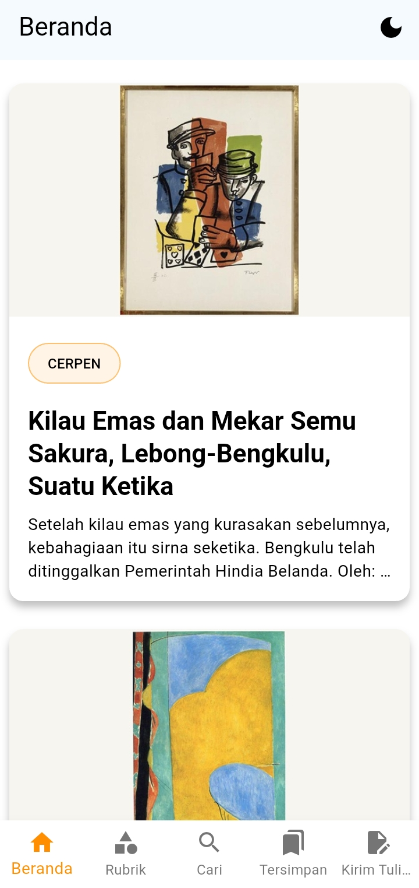
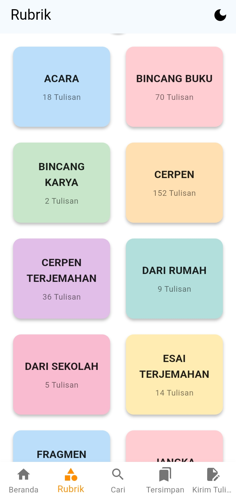
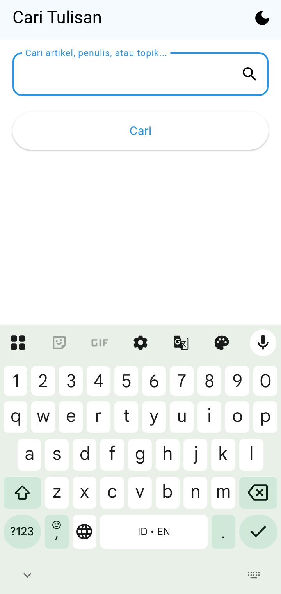
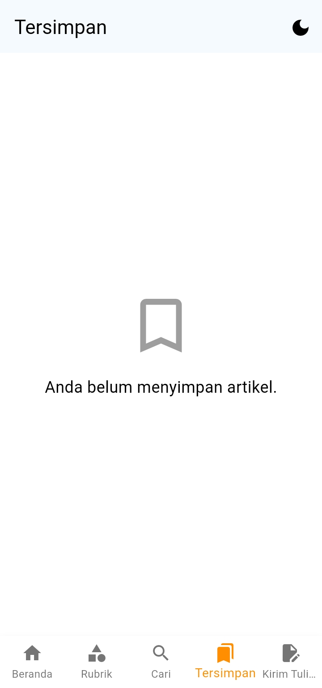
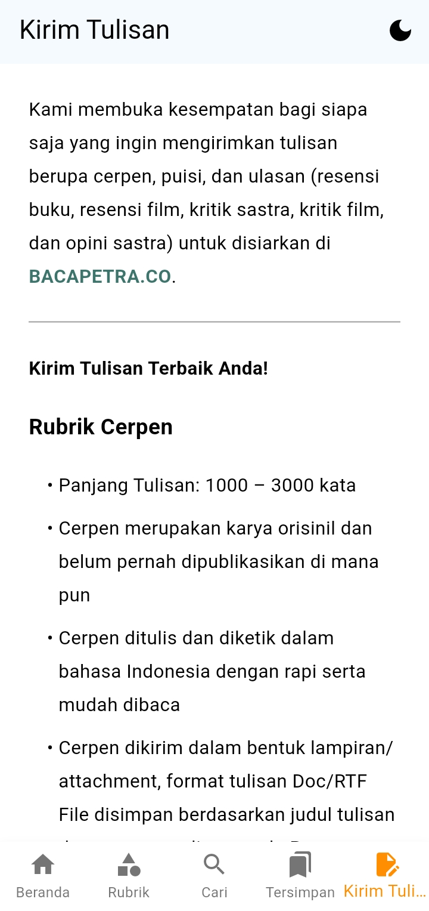

# BacaPetra 📱

[](https://github.com/rebarakaz/bacapetra_app)
[](https://opensource.org/licenses/MIT)
[](https://flutter.dev)

A modern Flutter application for reading articles from BacaPetra (bacapetra.co), featuring a clean Material Design interface with dark/light theme support.

## ✨ Features

- 📖 **Article Reading**: Browse and read articles from BacaPetra with smooth scrolling
- 📊 **Reading Progress Bar**: Visual indicator showing your reading progress in articles
- 🏷️ **Categories**: Explore articles by categories/rubrics
- 👤 **Authors**: Discover articles by specific authors
- 🔍 **Smart Search**: Find articles with powerful search functionality (accessible from AppBar)
- 🔥 **Popular Posts**: Discover trending articles based on community engagement
- 🔖 **Bookmarks**: Save favorite articles for later reading
- 💬 **Comments**: View and interact with article comments
- 📱 **Offline Reading**: Save articles for offline access
- 🚀 **Image Caching**: Faster loading and reduced data usage with intelligent image caching
- 🔤 **Font Scaling**: Adjustable font size for better readability (70%-150%)
- 🌙 **Theme Support**: Light, dark, and system theme modes
- 🌐 **WebView Integration**: Open external links seamlessly
- 🔗 **Social Media Links**: Quick access to BacaPetra's website and Instagram
- 📱 **Responsive Design**: Optimized for mobile devices with improved navigation UX

## 🏗️ Architecture

This app follows Flutter best practices with a well-organized structure:

```
lib/
├── models/          # Data models (Post, Category, Author)
├── providers/       # State management (Theme, Bookmarks)
├── screens/         # UI screens/pages
├── services/        # API services and external integrations
├── utils/           # Shared utilities and constants
└── widgets/         # Reusable UI components
```

### Key Components

- **Models**: Clean data structures for API responses
- **Providers**: State management using Provider pattern
- **Services**: Centralized API calls with error handling
- **Widgets**: Reusable UI components (PostCard, LoadingWidget, ErrorWidget)
- **Utils**: Shared utilities and app constants

## 🚀 Getting Started

### Prerequisites

- Flutter SDK (3.0 or higher)
- Dart SDK (3.0 or higher)
- Android Studio / VS Code with Flutter extensions

### Installation

1. **Clone the repository**
   ```bash
   git clone https://github.com/rebarakaz/bacapetra_app.git
   cd bacapetra_app
   ```

2. **Install dependencies**
   ```bash
   flutter pub get
   ```

3. **Run the app**
   ```bash
   flutter run
   ```

## 📥 Download

[](https://github.com/rebarakaz/bacapetra_app/releases/latest/download/BacaPetra-v1.2.0.apk)

**Latest Release:** [v1.2.0](https://github.com/rebarakaz/bacapetra_app/releases/tag/v1.2.0)

### Build for Production

**Android APK:**
```bash
flutter build apk --release
```

**iOS (on macOS):**
```bash
flutter build ios --release
```

## 📱 Screenshots

### Home Screen - Article Feed


### Categories - Browse by Topics


### Search - Find Articles


### Bookmarks - Saved Articles


### Submit Article - Contribute Content


## 🛠️ Technologies Used

- **Flutter**: Cross-platform mobile development
- **Dart**: Programming language
- **Provider**: State management
- **HTTP**: Network requests
- **HTML Unescape**: HTML content processing
- **Shared Preferences**: Local data persistence
- **SQLite**: Offline data storage
- **Cached Network Image**: Intelligent image caching for performance
- **URL Launcher**: External link handling
- **Share Plus**: Social sharing functionality
- **WebView Flutter**: In-app web content display

## 🔧 Configuration

The app uses the following key configurations:

- **API Base URL**: `https://www.bacapetra.co/wp-json/wp/v2`
- **Theme Modes**: System, Light, Dark
- **Pagination**: 10 items per page by default

## 📂 Project Structure Details

```
lib/
├── main.dart                    # App entry point
├── models/
│   ├── post.dart               # Post model
│   ├── category.dart           # Category model
│   ├── author.dart             # Author model
│   └── comment.dart            # Comment model
├── providers/
│   ├── theme_provider.dart     # Theme management
│   ├── bookmark_provider.dart  # Bookmark management
│   └── font_size_provider.dart # Font size scaling
├── screens/
│   ├── beranda_screen.dart     # Home screen
│   ├── detail_artikel_screen.dart # Article detail
│   ├── rubrik_screen.dart      # Categories screen
│   ├── author_screen.dart      # Author articles
│   ├── cari_screen.dart        # Search screen
│   ├── bookmark_screen.dart    # Bookmarks screen
│   ├── kirim_tulisan_screen.dart # Submit article
│   └── offline_screen.dart     # Offline reading
├── services/
│   ├── api_service.dart        # API service layer
│   └── database_helper.dart    # SQLite database management
├── utils/
│   ├── constants.dart          # App constants
│   ├── html_utils.dart         # HTML utilities
│   └── helpers.dart            # Helper functions
└── widgets/
    ├── post_card.dart          # Article card widget
    ├── loading_widget.dart     # Loading indicator
    ├── error_widget.dart       # Error display widget
    └── comments_section.dart   # Comments display widget
```

## 🤝 Contributing

1. Fork the repository
2. Create a feature branch (`git checkout -b feature/amazing-feature`)
3. Commit your changes (`git commit -m 'Add some amazing feature'`)
4. Push to the branch (`git push origin feature/amazing-feature`)
5. Open a Pull Request

## 📄 License

This project is licensed under the MIT License - see the [LICENSE](LICENSE) file for details.

## 🙏 Acknowledgments

- [BacaPetra](https://www.bacapetra.co) for providing the content API
- Flutter community for excellent documentation and packages
- Material Design for beautiful UI components

## 📞 Support

If you have any questions or issues, please open an issue on GitHub or contact the development team.

---

**Happy Reading! 📚**
